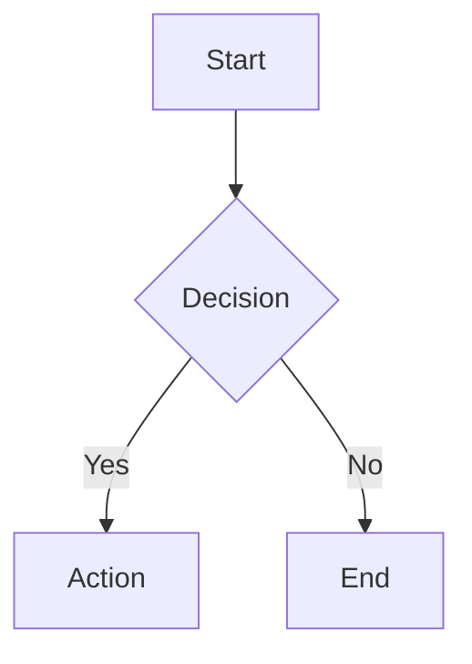
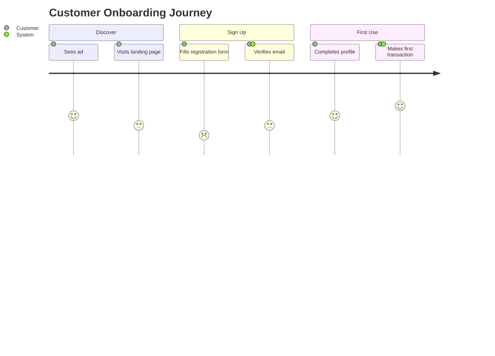
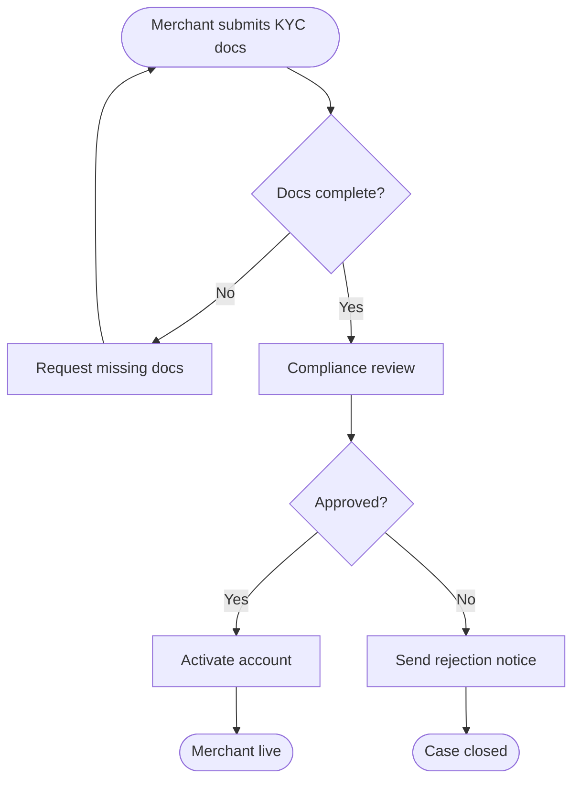
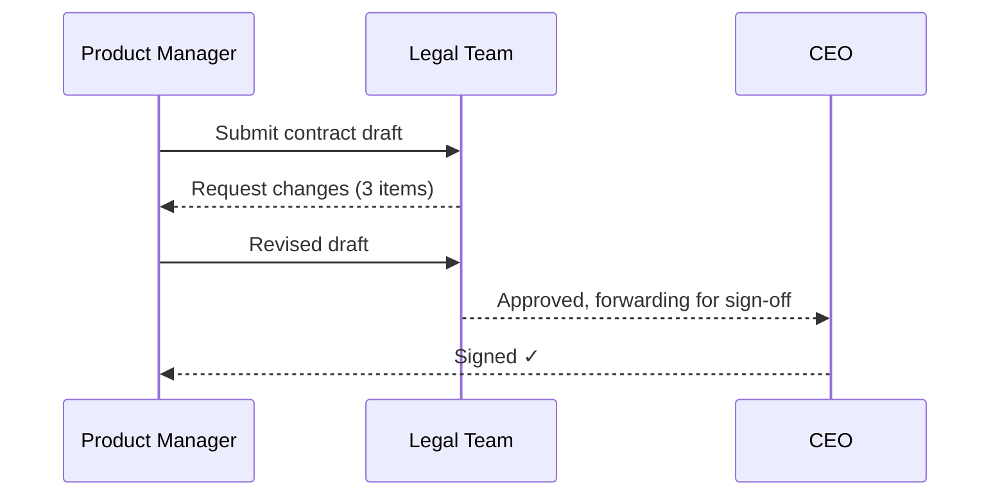
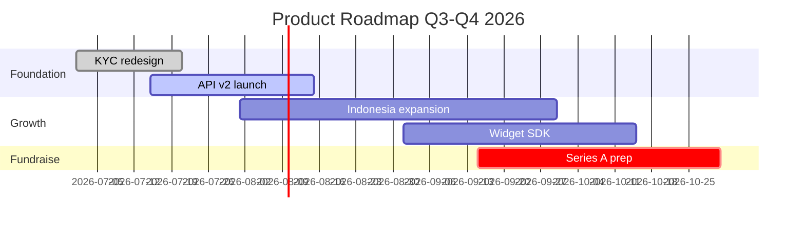

# Diagrams — Mermaid.js v11

Create text-based diagrams using Mermaid.js v11 declarative syntax. Outputs inline markdown code blocks — no tool installation needed for GitHub, Notion, or Confluence rendering.

## Your mission

<task>
$ARGUMENTS
</task>

## When to Use

- User journey maps — visualize end-to-end customer experience
- Business process flowcharts — document how a process works
- Approval flows — show who approves what, in sequence
- Roadmap timelines — Gantt-style phase/milestone view
- Meeting facilitation — live diagram generation during a discussion

---

## Quick Start

Wrap any diagram in a fenced code block:

````markdown

````

---

## PM Diagram Patterns

### User Journey Map
Show the customer experience across touchpoints with satisfaction scores.



### Business Process Flowchart
Document how a process flows, including decision points and actors.



### Approval Flow (Sequence Diagram)
Show who sends what to whom, and what decisions are made.



### Roadmap (Gantt)
Show phases, milestones, and timelines.



---

## Diagram Type Reference

### Flowchart
```
flowchart {direction}   — TD (top-down), LR (left-right), BT, RL
  nodeId[label]         — rectangle
  nodeId(label)         — rounded
  nodeId{label}         — diamond (decision)
  nodeId([label])       — stadium (start/end)
  A --> B               — solid arrow
  A -.-> B              — dotted arrow
  A -->|label| B        — labelled arrow
```

### Sequence Diagram
```
sequenceDiagram
  participant A as Actor Name
  A->>B: Message
  B-->>A: Response
  Note over A,B: Annotation
  loop Retry logic
    A->>B: Retry
  end
  alt Happy path
    B-->>A: Success
  else Error
    B-->>A: Error
  end
```

### Gantt (Roadmap)
```
gantt
  title Title
  dateFormat YYYY-MM-DD
  section Phase Name
    Task name :status, id, start-date, duration
    — status: done | active | crit | milestone
    — duration: 7d or end-date
```

### User Journey
```
journey
  title Title
  section Section Name
    Task description: score(1-5): Actor1, Actor2
```

### Quadrant (Prioritization)
```
quadrantChart
  title Priority Matrix
  x-axis Low Effort --> High Effort
  y-axis Low Impact --> High Impact
  Feature A: [0.2, 0.8]
  Feature B: [0.7, 0.5]
```

### Mindmap (Brainstorm Output)
```
mindmap
  root((Central Topic))
    Branch 1
      Sub-item
    Branch 2
      Sub-item
```

### Timeline (Milestones)
```
timeline
  title Key Milestones
  2026 Q1 : Soft launch : First tenant live
  2026 Q2 : Indonesia expansion
  2026 Q3 : Series A
```

---

## Configuration (Optional)

Add a frontmatter block to customize theme:

````markdown

````

**Themes:** `default`, `neutral`, `dark`, `forest`, `base`
**Look:** `classic` (default), `handDrawn` (sketchy style)

---

## Rendering

| Environment | How to render |
|-------------|---------------|
| GitHub / GitLab | Paste the fenced block — auto-rendered |
| Notion | `/code` block → select Mermaid |
| Confluence | Mermaid plugin |
| VS Code | Markdown Preview Mermaid Support extension |
| Browser | `https://mermaid.live` — paste and export PNG/SVG |

---

## Example Invocations

```
/diagrams-mermaid "User journey for merchant onboarding"
/diagrams-mermaid "Approval flow for payment exception review"
/diagrams-mermaid "Roadmap Q3-Q4 with Indonesia expansion and fundraise milestone"
/diagrams-mermaid "Business process: refund request handling"
```
