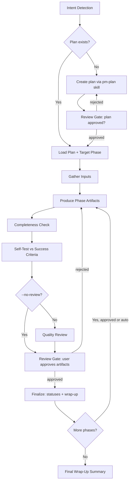

# Cook — Execute a Plan, Produce the Deliverables

End-to-end execution of PM plans with phase discipline: read plan → produce each phase's artifacts → verify against success criteria → update statuses → wrap up.

**Principles:** Scoping discipline (produce only what the phase asks) | Concision | No skipped gates

## Usage

```
Execute: <natural language task OR plan/phase path>
```

**Optional flags to select the workflow mode:**
- `--interactive`: full workflow with review gates (**default**)
- `--fast`: skip clarification, minimal ceremony
- `--auto`: auto-approve all gates, run all phases continuously
- `--no-review`: skip the quality-review step

**Example:**
```
"Execute plans/2026-06-12-pricing-launch/phase-02-draft-prd.md"
"Work through the market research plan --auto"
```

<HARD-GATE>
Do NOT produce deliverables until a plan exists and has been reviewed.
This applies regardless of task simplicity. "Simple" documents are where unexamined assumptions waste the most time.
If no plan exists: create one first (use the pm-plan skill), get it approved, then execute.
User override: if the user explicitly says "just write it" or "skip planning", respect their instruction.
</HARD-GATE>

## Anti-Rationalization

| Thought | Reality |
|---------|---------|
| "This document is too simple to plan" | Simple documents have hidden assumptions. A plan takes 30 seconds. |
| "I already know what to write" | Knowing ≠ planning. Write it down. |
| "Let me just start drafting" | Undisciplined drafting wastes effort. Plan first. |
| "The user wants speed" | Fastest path = plan → produce → done. Not: draft → rework → rewrite. |
| "I'll plan as I go" | That's not planning, that's hoping. |
| "Just this once" | Every skip is "just this once." No exceptions. |

## Smart Intent Detection

| Input Pattern | Detected Mode | Behavior |
|---------------|---------------|----------|
| Path to `plan.md` or `phase-*.md` | execute | Run the existing plan |
| Contains "fast", "quick" | fast | Minimal clarification, straight to production |
| Contains "trust me", "auto" | auto | Auto-approve all gates, all phases continuously |
| Contains "no review", "skip review" | no-review | Skip quality-review step |
| Default | interactive | Full workflow with review gates |

See `references/intent-detection.md` for detection logic.

## Process Flow (Authoritative)



**This diagram is the authoritative workflow.** Prose sections below provide detail for each node. If prose conflicts with this flow, follow the diagram.

## Workflow Overview

```
[Detect] → [Load/Create Plan] → [Gate] → per phase: [Produce] → [Completeness] → [Self-Test] → [Quality Review] → [Gate] → [Finalize Phase] → [Wrap-Up]
```

**Default (non-auto):** stops at `[Gate]` checkpoints for user approval.
**Auto mode (`--auto`):** skips approval gates, executes all phases continuously. Quality checks still run.

| Mode | Clarification | Quality Review | Approval Gates | Phase Progression |
|------|---------------|----------------|----------------|-------------------|
| interactive | ✓ | ✓ | **User approval at each gate** | One at a time |
| auto | ✓ | ✓ (auto-approve ≥9.5) | Skipped | All at once |
| fast | ✗ | ✓ (simplified) | User approval at each gate | One at a time |
| no-review | ✓ | ✗ | User approval at each gate | One at a time |

## Step Output Format

```
✓ Step [N]: [Brief status] - [Key metrics]
```

## Always-Enforced Checks (all modes)

- **Completeness check:** every section/deliverable the phase file promises exists in the artifact — no silent omissions
- **Self-test:** walk the artifact against the phase's Success Criteria, one criterion at a time, pass/fail each
- **Quality review** (unless `--no-review`): checklist pass — clarity, testability of requirements, consistency, stakeholder readiness (see `references/review-cycle.md`)
- **Finalize (MANDATORY — never skip):**
  1. Update the phase file: mark completed Todo items `[ ] → [x]`, set Overview status
  2. Update `plan.md`: phase table statuses + frontmatter status (`pending`/`in-progress`/`completed`) — sync from the **actual checkbox state of ALL phases**, not only the current one
  3. Wrap-up summary: artifacts produced, where they live, open questions
  4. Offer to save/export artifacts wherever the user keeps documents (e.g., copy to a shared folder, paste-ready format)

## References

- `references/intent-detection.md` — detection rules and routing logic
- `references/workflow-steps.md` — detailed step definitions for all modes
- `references/review-cycle.md` — document quality review cycle
